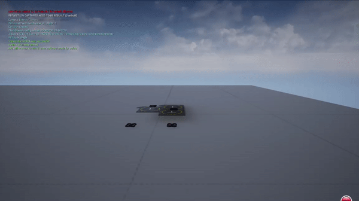
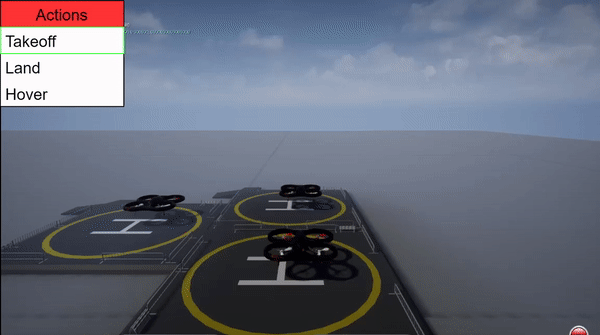
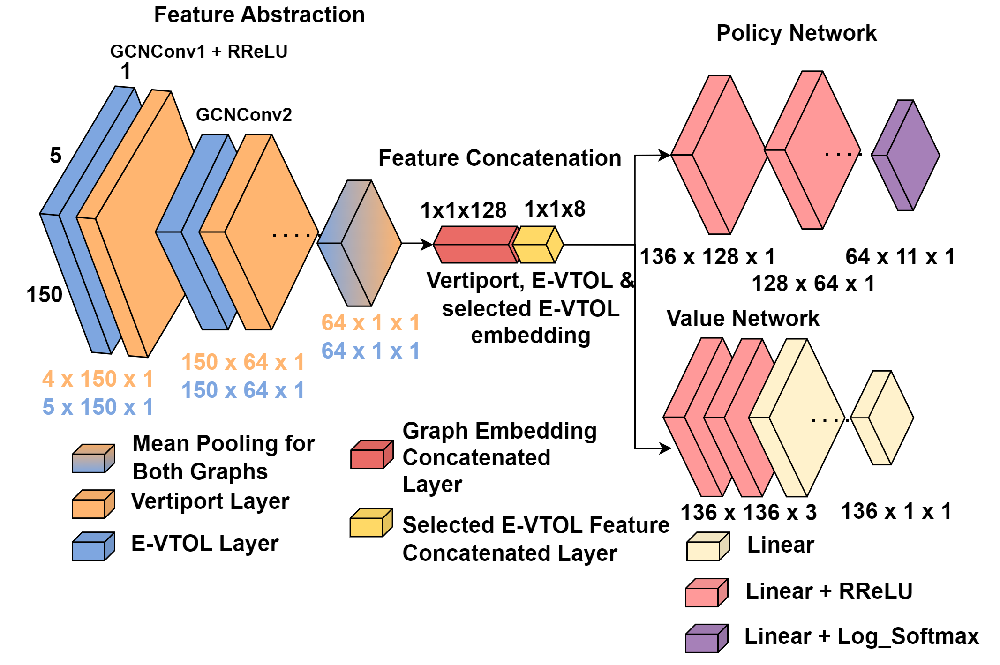

# UAM_RL
Designing a reinforcement learning air traffic controller agent for use in an Unreal Engine simulator with an Airsim client.

This is a refactored (and still in the refactoring process) version of the [GLUAM](https://github.com/JhoelWit/GLUAM) repository, used for ICRA 2022 and SciTech 2023. 

The goal was to create an air traffic controller agent which could assume the responsibilities of a real life ATC, utilizing urban air mobility to command electrical vertical takeoff and landing vehicles around a vertiport. The problem is formulated as a markov decision process, and PPO is used for the reinforcement learning algorithm. 

Unreal Engine and Airsim is used to create a simple environment for training and testing, consisting of three helipad objects (2 normal ports and one battery charging port):

The action space consists of 11 actions, and the state space is formulated as two homogeneous graphs, for the vertiport and eVTOLs respectively. 

The PPO policy uses graph neural networks to extract key features from the two graphs, and propagates them through a mulit-layered perceptron to get log probabilities for the next discrete action:

The papers will be attached to this readme once they're published and/or added to arXiv. 
